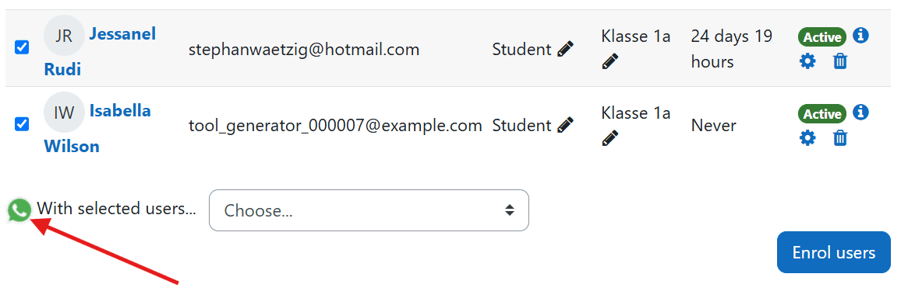
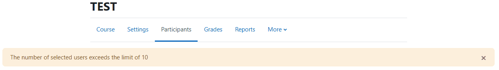
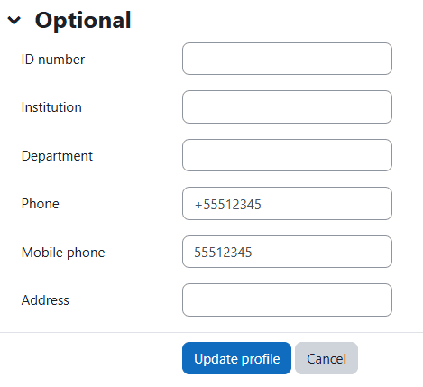

# ABOUT

The plugin is developed, supported and maintained by Stephan Waetzig, Karsdorf, Germany https://github.com/WaetzigS , https://de.linkedin.com/in/stephan-waetzig-528562155

Branches
--------
The following git branches are supported:

| Moodle version        | Branch            |
|-----------------------|-------------------|
| Moodle 4.5            | MOODLE_405_STABLE |

# PURPOSE

For many participants and in situations where you need a fast reply from them, WhatsApp is more effective. With this plugin, you can create messages with placeholders, such as name, etc., and send them to the participants.

This plugin is not intended for sending bulk messages for non-educational or commercial purposes.

For trainers, it's easy to navigate to the course members, select the participants, craft one message, and generate this message for all the selected participants.

# DOCUMENTATION

https://github.com/WaetzigS

# INSTALL

1. Log in to your Moodle site as an admin and go to _Site administration >
   Plugins > Install plugins_.

2. Upload the ZIP file with the plugin code. 

3. Check the plugin validation report and finish the installation.

The plugin can be also installed by putting the contents of this directory to

    {your/moodle/dirroot}/local/whatsappgen

Afterwards, log in to your Moodle site as an admin and go to _Site administration >
Notifications_ to complete the installation.

Alternatively, you can run

    $ php admin/cli/upgrade.php

to complete the installation from the command line.

# HOW TO USE

1. Select the course and open the participants list.

2. Check the boxes next to the students for whom you want to generate a WhatsApp message.

3. A symbol with the WhatsApp logo will then appear. A click / tab will redirect you to the message generator

4. Type your WhatsApp message in the textarea. Below the textarea, you will see the standard placeholders. For example, use %%firstname%% to insert each participant's first name. You'll also find special formats for WhatsApp, allowing you to format text in bold, italics, etc. Also you see a list for which participants the message will generated. On the right side of the page, you can see which participants, marked in green font, you can create the message for.

5. Once you've finished typing the message, click the "Generate" button. A new tab will open for each participant with the generated message. You can then choose to send the message via WebWhatsApp or the WhatsApp Application. It's highly recommended to install the application and configure your browser to allow pop-ups for seamless redirection to the WhatsApp application.

6. It's automatically recirect to your course participants.

# SETTINGS

In the settings you can set this:

1. Maximum generated messages at once
The performance depends on your hardware. For each participant, a new browser tab will open. Some devices may struggle with handling many browser tabs simultaneously. To manage this, you can set a limit. If you try to generate messages beyond this limit, you will receive a notification, and the system will prevent you from generating the messages. We advice to choose the limit of maximum 10.

2. Default Default WhatsApp Number
Please select the user field where you save the WhatsApp numbers. You can save these numbers in the "Phone" or "Smartphone" user fields. The system will use this field to generate the message for the respective number.

3. Allow Roles
Here, you can set the default roles that are allowed to use this plugin and create messages. Please note that after the creation, the number of participants will be displayed.

4. Tracking in Database
You can set up database tracking in the whatsappgen_messages table here. This allows you to see which users created messages for which participants. Please note that creating a message does not guarantee it is sent. It's possible that the WhatsApp number is invalid or not available in the system.

# FAQ

1. How do I insert the phone numbers of the participants?
Please enter the phone numbers in the user-edit section under Telephone (phone1) or Smartphone (phone2). It’s best to include the country code and the phone number, like for Germany +491234567. It's also acceptable to enter the number with a leading 0. The system will generate the complete number using the country code from the user field "country." If the number contains special characters, don't worry, they will be removed automatically.

2. My messages are not generating. It's automatically redirect to the participants overview. What should I do?
Please be sure, your browser allows to open the popups from WhatsApp. After that it will generate the messages

3. Why I have to click so many things before the message is in WhatsApp?
We advice to download the WhatsApp Application and set it like this you browser can open it automatically. 

4. My hardwares performance is very low when I generate the message. What can I do?
For every particaipant it opens one more tab. Please don't choose so lot of participants. After your performance will be better.

5. Do I always need a course to send the WhatsApp-messages?
Yes, because messages should always be sent within an educational setting and not for sending bulk messages. Setting this plugin in the system context could cause issues.

6. Some translations are not correct. Why?
The translation was created by a chatbot. Please report it or send me the correct lang-file.

7. I found a bug. How I can report?
Please report it on github https://github.com/WaetzigS 

# License

2024 Stephan Waetzig <stephanwaetzig@hotmail.com> 

This program is free software: you can redistribute it and/or modify it under
the terms of the GNU General Public License as published by the Free Software
Foundation, either version 3 of the License, or (at your option) any later
version.

This program is distributed in the hope that it will be useful, but WITHOUT ANY
WARRANTY; without even the implied warranty of MERCHANTABILITY or FITNESS FOR A
PARTICULAR PURPOSE.  See the GNU General Public License for more details.

You should have received a copy of the GNU General Public License along with
this program.  If not, see <https://www.gnu.org/licenses/>.

